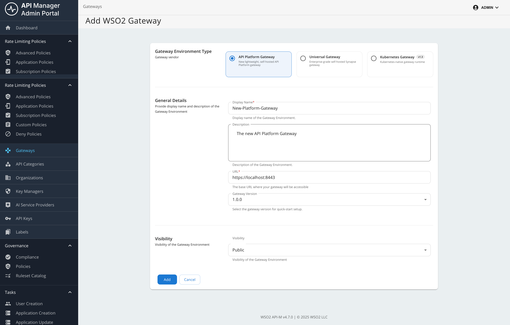
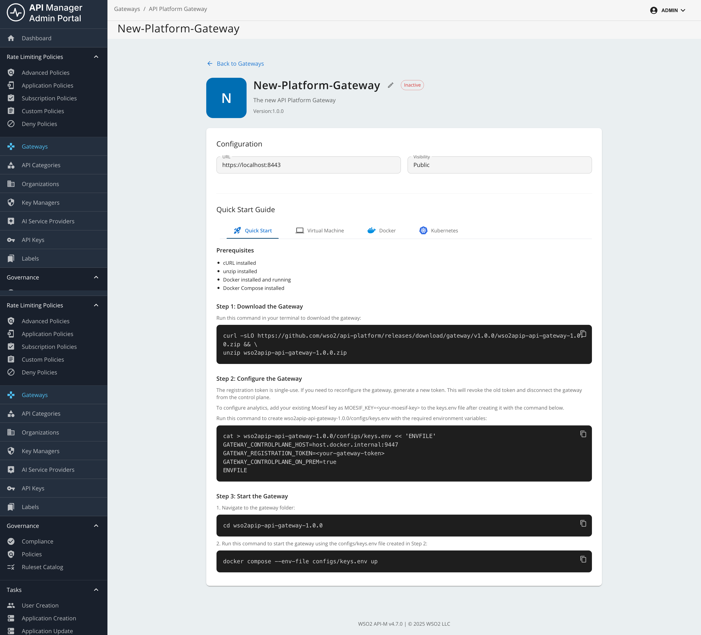
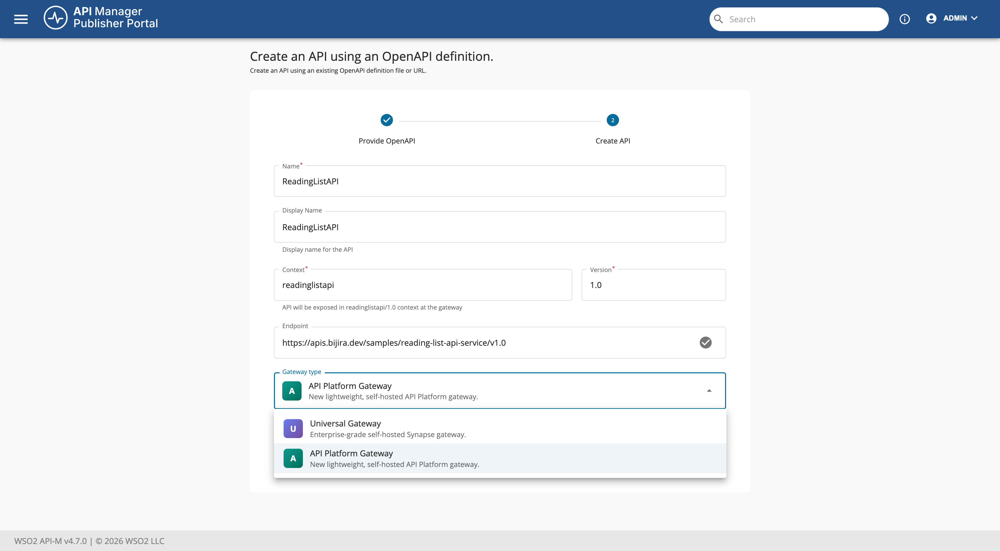

# Getting Started with API Platform Gateway

This guide walks you through setting up an API Platform Gateway in your environment. Follow these steps to get the gateway running and connected to the Control Plane.

## Overview

The API Platform Gateway is a lightweight, Envoy-based gateway distribution that connects to the WSO2 API Platform Control Plane. It is intended for hybrid API Platform deployments where the gateway runtime stays in your own infrastructure, while API design, deployment, policy configuration, and visibility are handled centrally through the Control Plane.

## Prerequisites

Before you begin, ensure that you have the following:

- **cURL**
- **unzip**
- **Docker** installed and running
- **Docker Compose** installed

## Create an API Platform Gateway in the Admin Portal

1. Sign in to the **Admin Portal**.
2. Go to the **Gateways** section from the left navigation panel.
3. In the **WSO2 Gateways** section, click **Add WSO2 Gateways**.

    

4. Select **API Platform Gateway** from **Gateway Environment Type**.
5. Provide the following details:

    - **Display Name**: A unique name for your gateway.
    - **Description**: An optional description.
    - **URL**: The URL where the gateway will be accessible (host and port depend on your deployment; for example, `https://<gateway-host>:<gateway-port>`).
    - **Visibility**: Dev Portal visibility based on roles.

    

6. Click **Add**.

## Setup the Gateway

1. Next, download, configure, and start the gateway on your machine by following the steps in the **Quick Start** section or the detailed instructions below (Steps 1-4).

    !!! note
        In Quick Start, copy the generated commands from the UI. For manual setup, use the detailed steps below.

    

### Step 1: Download the Gateway

Prefer the download command shown in the Admin Portal for your gateway so the release version always matches the connector. Alternatively, replace `<gateway-version>` in the following example with that release tag (for example, `v1.0.0`):

```bash
curl -sLO https://github.com/wso2/api-platform/releases/download/gateway/<gateway-version>/wso2apip-api-gateway-<gateway-version>.zip && \
unzip wso2apip-api-gateway-<gateway-version>.zip
```

### Step 2: Configure the Gateway

Run the following command to create the gateway configuration (use the same `<gateway-version>` folder name as in Step 1):

```bash
cat > wso2apip-api-gateway-<gateway-version>/configs/keys.env << 'ENVFILE'
GATEWAY_CONTROLPLANE_HOST=<your-control-plane-host>:9443
GATEWAY_REGISTRATION_TOKEN=<your-gateway-token>
ENVFILE
```

When you copy this command from the UI, the placeholder values are populated automatically.

### Step 3: Start the Gateway

Navigate to the gateway directory and start the gateway using Docker Compose:

```bash
cd wso2apip-api-gateway-<gateway-version>
docker compose --env-file configs/keys.env up
```

### Step 4: Verify the Gateway

Check that the gateway is running and connected:

```bash
# Check container status
docker compose ps

# Check gateway health (use the host and health endpoint port from your gateway configuration)
curl http://<gateway-host>:<gateway-health-port>/health
```

The gateway should appear as active in the Control Plane.


## Add an API and invoke it

!!! note
    This feature is currently available only for REST APIs that are created from scratch, or by importing from OpenAPI.

    It is not currently available for WebSocket, GraphQL, MCP, or AI APIs.

### Step 1: Create a REST API

In this example, you will use the URL of an OpenAPI definition to create a REST API.

For detailed API creation steps, see [Create a REST API]({{base_path}}/api-design-manage/design/create-api/create-rest-api/create-a-rest-api/).

1. Sign in to the **Publisher Portal**.
2. Click **REST APIs**.
3. Select **Import Open API**.
4. Select the **URL** option and provide the following URL:

```text
https://raw.githubusercontent.com/wso2/bijira-samples/refs/heads/main/reading-list-api/openapi.yaml
```

5. Select the gateway type as **API Platform Gateway**.
   
    

6. Click **Create**.

### Step 2: Deploy the REST API

This step is optional during the initial creation because the API is deployed to the gateway by default. If you change the API later, you must redeploy it.

To redeploy the API:

1. Navigate to the **Deployments** page of the API.
   
    

2. Click **Deploy**.
   
    

## Test the API with cURL

You can test the API in two ways:

1. Without authentication headers (for APIs that are not protected by an API key policy)
2. With an API key header (for APIs protected by an API key policy)

If you want to enforce API-key-based authentication, add the **API Key** policy to the API and deploy the updated revision.

!!! info
    - For policy configuration steps, see [Adding and Managing Policies]({{base_path}}/api-gateway/api-platform-gateway/adding-and-managing-policies/).
    - When an API is deployed to API Platform Gateway, gateway policies are managed through [Policy Hub](https://wso2.com/api-platform/policy-hub).
    - For API-key-based authentication, use the [API Key Authentication policy](https://wso2.com/api-platform/policy-hub/policies/api-key-auth).

Use the following cURL commands to verify both behaviors. Replace `<gateway-host>` and `<gateway-port>` with the host and port from the gateway **URL** you set in the Admin Portal.

1. Invoke the API **without** an API key.

```bash
curl "https://<gateway-host>:<gateway-port>/readinglistapi/1.0/books" -X GET -k
```

This request succeeds when the API does not require an API key. If an API key policy is enabled, this request is expected to fail with an authentication error.

2. Invoke the API with the API key header configured in the policy (for example, header name `X-API-Key`).

```bash
curl -k -i "https://<gateway-host>:<gateway-port>/readinglistapi/1.0/books" \
  -H "X-API-Key: <your-generated-api-key>"
```

If the API key is valid, the request succeeds and returns a successful response from the backend. Ensure the header name in your cURL command exactly matches the header name configured in the API Key policy.

## Next steps

- [Setting Up API Platform Gateway]({{base_path}}/api-gateway/api-platform-gateway/setting-up/)
- [Adding and Managing Policies]({{base_path}}/api-gateway/api-platform-gateway/adding-and-managing-policies/)
